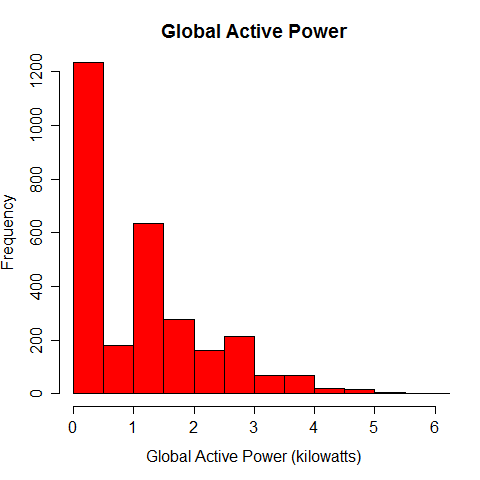
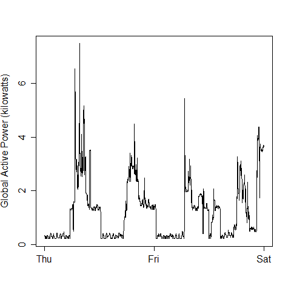
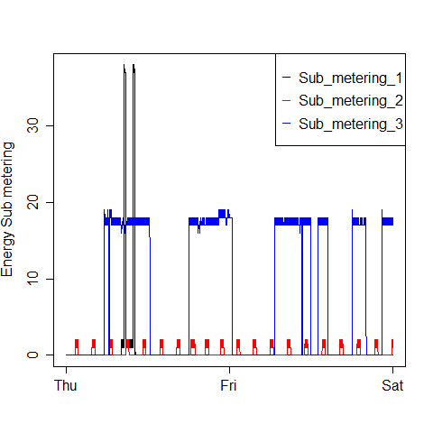
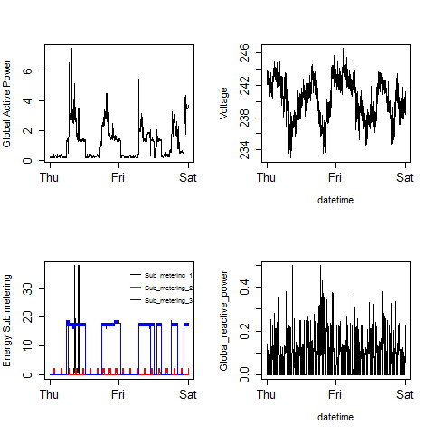

## Project Description:

The purpose of this project is to demonstrate the ability to generate plots using R's ***Base Plotting System***, as part of **Exploratory Data Analysis** to examine how household energy usage varies over a 2-day period in February, 2007. 

## Data: 

This assignment uses data from the <a href="http://archive.ics.uci.edu/ml/">UC Irvine Machine Learning Repository</a>, a popular repository for machine learning datasets. In particular, we will be using the "Individual household electric power consumption Data Set" which I have made available on the course web site:

* <b>Dataset</b>: <a href="https://d396qusza40orc.cloudfront.net/exdata%2Fdata%2Fhousehold_power_consumption.zip">Electric power consumption</a> [20Mb]

* <b>Description</b>: Measurements of electric power consumption in one household with a one-minute sampling rate over a period of almost 4 years. Different electrical quantities and some sub-metering values are available.

* <b>Fields</b>: The following descriptions of the 9 variables in the dataset are taken from the 
<a href="https://archive.ics.uci.edu/ml/datasets/Individual+household+electric+power+consumption">UCI web site</a>:

<ol>
<li><b>Date</b>: Date in format dd/mm/yyyy </li>
<li><b>Time</b>: time in format hh:mm:ss </li>
<li><b>Global_active_power</b>: household global minute-averaged active power (in kilowatt) </li>
<li><b>Global_reactive_power</b>: household global minute-averaged reactive power (in kilowatt) </li>
<li><b>Voltage</b>: minute-averaged voltage (in volt) </li>
<li><b>Global_intensity</b>: household global minute-averaged current intensity (in ampere) </li>
<li><b>Sub_metering_1</b>: energy sub-metering No. 1 (in watt-hour of active energy). It corresponds to the kitchen, containing mainly a dishwasher, an oven and a microwave (hot plates are not electric but gas powered). </li>
<li><b>Sub_metering_2</b>: energy sub-metering No. 2 (in watt-hour of active energy). It corresponds to the laundry room, containing a washing-machine, a tumble-drier, a refrigerator and a light. </li>
<li><b>Sub_metering_3</b>: energy sub-metering No. 3 (in watt-hour of active energy). It corresponds to an electric water-heater and an air-conditioner.</li>
</ol>
  
  
## Data Processing:

1. The data is downloaded, uncompressed, and loaded into a data frame, tbRawData, using `fread` of `data.table` package (about 8 seconds).
2. Prior to loading the complete file, required memory is roughly estimated to ensure it can fit in the memory. The size was estimated as number of columns * number of rows * 8 bytes => 9 * 2,075,259 * 8 => 149,418,648 Bytes =~ 150 MB.
3. The data for just 2007-02-01 and 2007-02-02 is extracted out with the help of `as.Date()` function, to create a new data frame table called tbTidyDataset. 
4. A new column datetime is added by combining the columns Date and Time with the help of `strptime()`.  
5. This cleaned up data set, called ***tbTidyDataset***, is used for creating all the plots for the exploratary analysis. 
  
***Code for Loading Data***:  
The R code for loading the data file , subsetting and creating the file data set is in  [load_and_tidyup_data.R](https://github.com/snrajesh/ExData_Plotting1/load_and_tidyup_data.R) 
  
  
## Exploratory Analysis:

The cleaned up data set is used for generating all plots (as in the sample provided) using the base plotting system. 
  
  
* The basic `R` plot functions like `hist`, `plot`, `points`, and `legend` are used for generating the plots.
* The plot is saved/copied to a PNG file, using `dev.copy`, with a width of 480 pixels and a height of 480 pixels.  

***Code Book*** is avilable on github repository - [CodeBook.md](https://github.com/snrajesh/ExData_Plotting1/blob/master/CodeBook.md).  
  

***Code for Making Plots***:  
* The R code used for each plot is saved in a R code file - named [plot1.R](https://github.com/snrajesh/ExData_Plotting1/blob/master/plot1.R), [plot2.R](https://github.com/snrajesh/ExData_Plotting1/blob/master/plot2.R), [plot3.R](https://github.com/snrajesh/ExData_Plotting1/blob/master/plot3.R), and [plot4.R](https://github.com/snrajesh/ExData_Plotting1/blob/master/plot4.R).  

* The code also checks to see if the data set is available in memory. If it is not available, it will call the load data script ([load_and_tidyup_data.R](https://github.com/snrajesh/ExData_Plotting1/blob/master/load_and_tidyup_data.R)) to load the data (***Estimated time: 10 seconds***).

  

## Results:

* The output plots (480 X 480 pixels in PNG format) are saved as separate files :  
[plot1.png](https://github.com/snrajesh/ExData_Plotting1/blob/master/plot1.png),    [plot2.png](https://github.com/snrajesh/ExData_Plotting1/blob/master/plot2.png),    [plot3.png](https://github.com/snrajesh/ExData_Plotting1/blob/master/plot3.png), and    [plot4.png](https://github.com/snrajesh/ExData_Plotting1/blob/master/plot4.png).    
  
  
### Plot 1 - Histogram to show distribution of global_active_power:
  
 
  
  
### Plot 2 - Plot to show relationship between global_active_power and day/time:
  
 
  
  
### Plot 3 - Plot to show relationship between Energy submetering and day/time:
  
 
  
  
### Plot 4 - Panel Plot to show relationship between Global Active Power, Voltage, Energy submetering, Global reactive power, and day/time:
  
 
  
  
  
 
## To Reproduce the Analysis:

Fork/Clone all the files from [Github Repository](https://github.com/snrajesh/ExData_Plotting1).  
Run [load_and_tidyup_data.R](https://github.com/snrajesh/ExData_Plotting1/blob/master/load_and_tidyup_data.R) to download and load the data.  
Run codes [plot1.R](https://github.com/snrajesh/ExData_Plotting1/blob/master/plot1.R), [plot2.R](https://github.com/snrajesh/ExData_Plotting1/blob/master/plot2.R), [plot3.R](https://github.com/snrajesh/ExData_Plotting1/blob/master/plot3.R), and [plot4.R](https://github.com/snrajesh/ExData_Plotting1/blob/master/plot4.R) to generate each of the plots.  

  
***Note***:  
To run all codes and generate all plots, run [EDA_project1.R](https://github.com/snrajesh/ExData_Plotting1/blob/master/EDA_project1.R), which will download the file (if it is not in the working directory), load the file, and generate all plots to the current directory. Please note that the script has code to download the file to your current directory. If yo don't wish to download the file, please comment out the download command (in step 1,line 33-38).
  
The toal execution time for the whole script (including download) is about *20 seconds*.
  